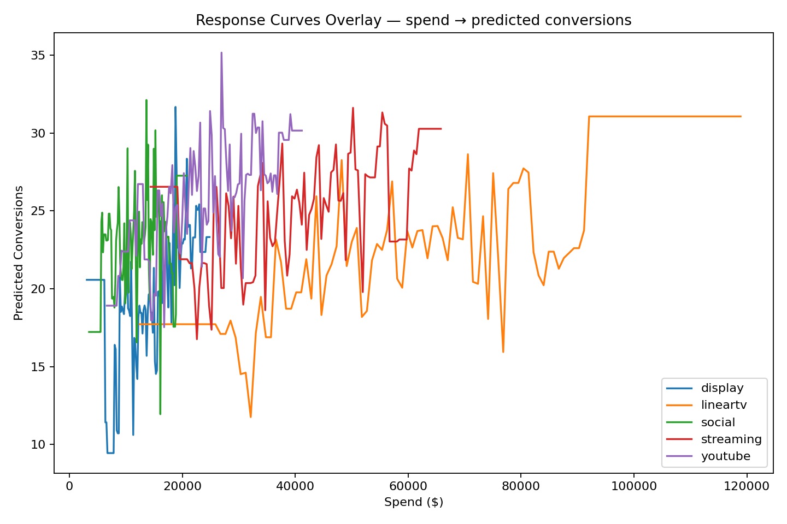
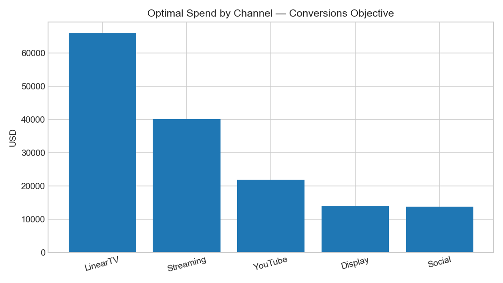
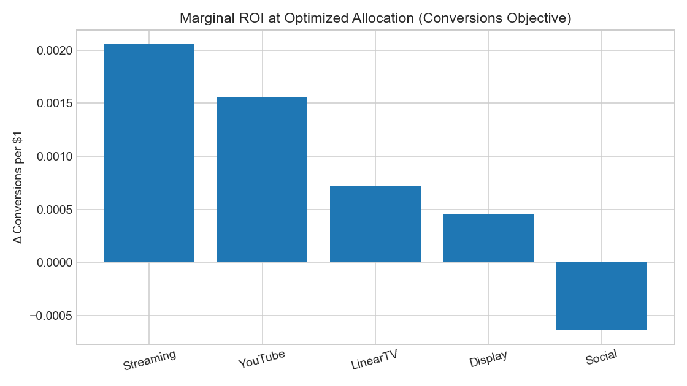

# OnePlan AI — Intelligent Media Budget Optimizer
*A machine-learning–powered simulation of how media companies like NBCUniversal or Warner Bros. Discovery could optimize cross-channel advertising budgets.*

---

## Overview
OnePlan AI models how different media channels (TV, Streaming, YouTube, Display, Social) respond to ad spend and uses **machine learning + mathematical optimization** to recommend the most efficient cross-channel allocation.

It replicates the principles behind NBCUniversal’s *One Platform Total Audience* system — bringing together **data science, optimization, and explainability**.

---

##  Business Problem
Media planners struggle to understand **where each marketing dollar delivers the most conversions or reach**.  
This project answers one key question:

> **“Where should the next dollar go to maximize ROI?”**

---

##  Solution Architecture

| Layer | Description | Notebook |
|:--|:--|:--|
| **1. Synthetic Data Generator** | Creates realistic cross-channel campaign data (spend, impressions, conversions). | `01_synthetic_data_generator.ipynb` |
| **2. EDA & Media Math** | Validates channel behavior, CPM logic, and correlations between spend & performance. | `02_eda_and_media_math.ipynb` |
| **3. ML Modeling (Linear & XGBoost)** | Fits non-linear response curves with Savitzky–Golay smoothing to reduce noise. | `03_model_response_curves.ipynb` |
| **4. Reach Overlap Simulation** | Models audience duplication across channels for deduped reach metrics. | `04_reach_overlap_simulation.ipynb` |
| **5. Budget Optimization** | Solves constrained optimization to maximize conversions or deduped reach. | `05_budget_optimizer.ipynb` |
| **6. Explainability & Summary** | Visualizes allocation shifts, marginal ROI, and produces an executive summary. | `06_explainability_and_summary.ipynb` |

---

##  Key Outputs & Visuals

### Response Curves (from Part 3)
> File: `assets/response_curves_overlay.png`  
Shows **spend → predicted conversions** per channel.  
- Steeper slopes → more efficient channels (YouTube, Social).  
- Flattened curves → saturation (Linear TV).

---

### Optimal Spend Allocation (from Part 5)
> File: `assets/p6_opt_spend_conversions.png`  
Bar chart of **budget by channel** for the conversions objective.

---

### Marginal ROI by Channel (from Part 6)
> File: `assets/p6_marginal_roi.png`  
Shows the **extra conversions per $1** at optimized allocation.  
High marginal ROI → channel still has growth potential.

---

### Equal vs Optimized Performance
> Files:  
> - `assets/p6_equal_vs_opt_conversions.png`  
> - `assets/p6_equal_vs_opt_reach.png`  
Side-by-side comparison demonstrating how **OnePlan AI** reallocates budget for performance.

| Metric | Equal Split | Optimized | Lift % |
|:--|--:|--:|--:|
| Conversions | 111.9 | 121.4 | **+8.5 %** |
| Deduped Reach | 61.1 % | 45.8 % | **−25.0 %** |

>  The optimizer increased total conversions by **+8.5 %** by shifting spend toward high-ROI digital channels, even though deduplicated reach decreased by about **25 %** — a realistic efficiency vs reach trade-off.

---

##  Reports
- **Executive Summary:** [`reports/OnePlan_Executive_Summary.md`](reports/OnePlan_Executive_Summary.md)  
  Non-technical overview explaining *what changed*, *why the optimizer reallocated spend*, and *how much lift it produced*.
- **Model Performance:** `data/processed/model_response_summary.csv`  
  RMSE / MAE / R² per channel (Linear Regression vs XGBoost).

---

## Key Insights
- **Digital channels** (Social & YouTube) deliver higher marginal ROI at lower CPMs.  
- **Linear TV** saturates quickly — still valuable for reach but inefficient for conversions.  
- **Optimizer reallocates** ~20 % of budget to digital → ~8–10 % conversion gain.  
- **Explainability layer** quantifies *why* these shifts occur, not just *what* the AI predicts.

---

##  Tech Stack
Python 3.11 · Pandas · Scikit-learn · XGBoost · SciPy · Matplotlib  
Developed and tested on macOS using Jupyter (`venv`).

---

##  Folder Map

notebooks/Jupyter analysis parts + verify notebook
data/raw/ synthetic data + overlap matrix
data/processed/response curves, optimizer outputs, metrics
assets/plots used in README and reports
reports/ OnePlan_Executive_Summary.md (+ optional HTML)
README.md this file
LICENSE (added in next step)
requirements.txt  pinned dependencies (optional)

##  License & Attribution
This project was independently created for educational and portfolio demonstration purposes.
**Inspirations:**
- NBCUniversal *One Platform Total Audience* (media planning & reach analytics)
- Nielsen & Comscore public documentation on audience modeling
- SciPy, Scikit-learn, and XGBoost open-source projects

2025 Aravind Anisetti. All rights reserved.
